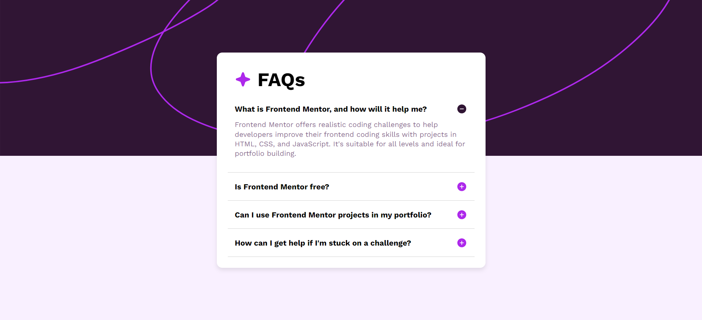

# Frontend Mentor - FAQ accordion solution

This is a solution to the [FAQ accordion challenge on Frontend Mentor](https://www.frontendmentor.io/challenges/faq-accordion-wyfFdeBwBz). Frontend Mentor challenges help you improve your coding skills by building realistic projects.

## Table of contents

- [Overview](#overview)
  - [The challenge](#the-challenge)
  - [Screenshot](#screenshot)
  - [Links](#links)
- [My process](#my-process)
  - [Built with](#built-with)
  - [What I learned](#what-i-learned)
  - [Continued development](#continued-development)
  - [Useful resources](#useful-resources)
- [Author](#author)
- [Acknowledgments](#acknowledgments)

## Overview

### The challenge

Users should be able to:

- Hide/Show the answer to a question when the question is clicked
- Navigate the questions and hide/show answers using keyboard navigation alone
- View the optimal layout for the interface depending on their device's screen size
- See hover and focus states for all interactive elements on the page

### Screenshot



### Links

- Live Site URL: [Add live site URL here](https://your-live-site-url.com)

## My process

### Built with

- Semantic HTML5 markup
- CSS custom properties
- Flexbox
- CSS Grid
- Mobile-first workflow
- Vanilla JavaScript

### What I learned

Working on this project helped me to enhance my skills in creating interactive elements using JavaScript. I learned how to manage state changes and update the DOM dynamically to reflect these changes. Here's a code snippet demonstrating the toggle functionality for the accordion items:

```html
<div class="accordian-title">
  <h3>What is Frontend Mentor, and how will it help me?</h3>
  
</div>
```

```css
.accordian-description {
  display: none;
  font-weight: 400;
  color: var(--Grayish-purple);
  font-size: 13px;
  margin-top: 10px;
  margin-bottom: 10px;
  line-height: 1.1rem;
}

.accordian-item.active .accordian-description {
  display: block;
}
```

```js
document.addEventListener('DOMContentLoaded', () => {
  const accordianItems = document.querySelectorAll('.accordian-item');

  accordianItems.forEach((item) => {
    const title = item.querySelector('.accordian-title');

    title.addEventListener('click', () => {
      const isActive = item.classList.contains('active');
      if (!isActive) {
        item.classList.add('active');
        title.querySelector('img').src = './assets/images/icon-minus.svg';
      } else {
        item.classList.remove('active');
        title.querySelector('img').src = './assets/images/icon-plus.svg';
      }
    });
  });
});
```

### Continued development

In future projects, I want to focus on improving accessibility by ensuring that all interactive elements are navigable via keyboard and that ARIA roles and properties are used where appropriate.

### Useful resources

- [MDN Web Docs](https://developer.mozilla.org/) - This is an amazing resource for all things web development, providing comprehensive documentation on HTML, CSS, and JavaScript.
- [CSS-Tricks](https://css-tricks.com/) - This website has been incredibly helpful for understanding modern CSS techniques and practices.

## Author

- Frontend Mentor - [@omk1r](https://www.frontendmentor.io/profile/omk1r)
- Twitter - [@yourusername](https://www.twitter.com/omk1rJ)

## Acknowledgments

I would like to thank the Frontend Mentor community for their support and feedback. The Discord community has been particularly helpful in providing guidance and answering questions.
